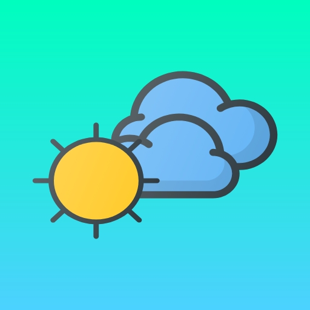

 
  

 

## Features 💡
- Mausam is an Android app to check weather.
- Weather of different cities around the world can be viewed by searching their name.
- Hourly forecast of the next 24 hours of your current location is available.
- Daily forecast of next week can also be checked to stay updated.

## Screenshots 📸
 

|   Current Weather  |   Weather Of Searched City   |   Next Week Forecast
|---	|---	|---
|      |      |       

 

## Built With 🛠
- [Kotlin](https://kotlinlang.org/) - First class and official programming language for Android development.
- [RxJava](https://github.com/ReactiveX/RxAndroid) - RxJava is a Java library that enables Functional Reactive Programming in Android development.
- [Android Architecture Components](https://developer.android.com/topic/libraries/architecture) - Collection of libraries that help you design robust, testable, and maintainable apps.
  - [Model View Presenter(MVP)](https://www.raywenderlich.com/7026-getting-started-with-mvp-model-view-presenter-on-android) - Android architecture used to structure project.
  - [LiveData](https://developer.android.com/topic/libraries/architecture/livedata) - Data objects that notify views when the underlying database changes.
  - [ViewBinding](https://developer.android.com/topic/libraries/view-binding) - Generates a binding class for each XML layout file present in that module and allows you to more easily write code that interacts with views.
  - [Room](https://developer.android.com/jetpack/androidx/releases/room) - The Room persistence library provides an abstraction layer over SQLite to allow for more robust database access while harnessing the full power of SQLite. 
- [Dependency Injection](https://developer.android.com/training/dependency-injection) - 
  - [Hilt-Dagger](https://dagger.dev/hilt/) - Standard library to incorporate Dagger dependency injection into an Android application.
- [Retrofit](https://square.github.io/retrofit/) - A type-safe HTTP client for Android and Java.
- [Moshi](https://github.com/square/moshi) - A modern JSON library for Kotlin and Java.
- [Moshi Converter](https://github.com/square/retrofit/tree/master/retrofit-converters/moshi) - A Converter which uses Moshi for serialization to and from JSON.
- [Glide](https://github.com/bumptech/glide) - Glide is a fast and efficient open source media management and image loading framework for Android
- [Material Components for Android](https://github.com/material-components/material-components-android) - Modular and customizable Material Design UI components for Android

## Credits 📖
- [Open Weather](https://openweathermap.org/api) is used to get all the weather data.
